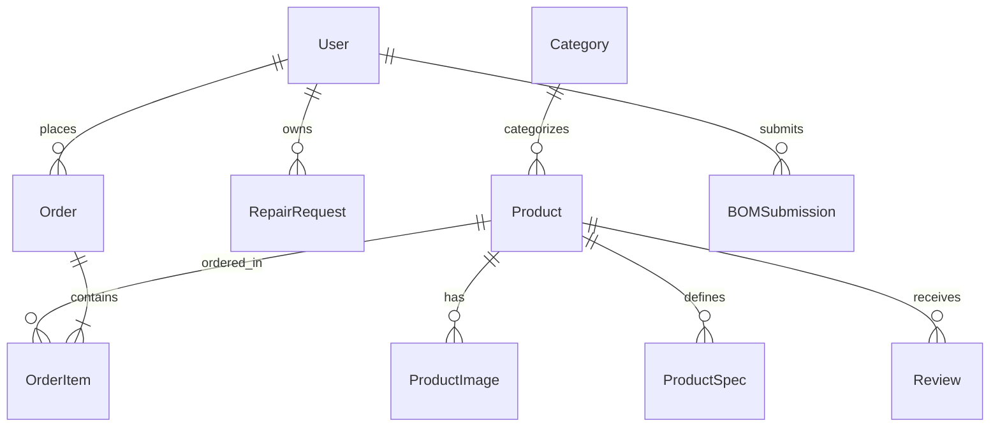
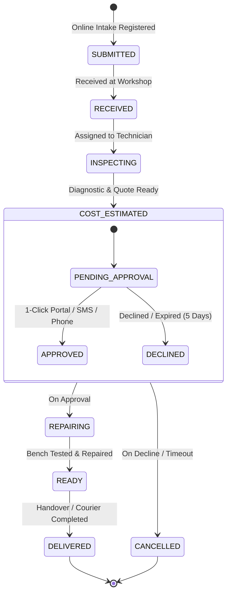
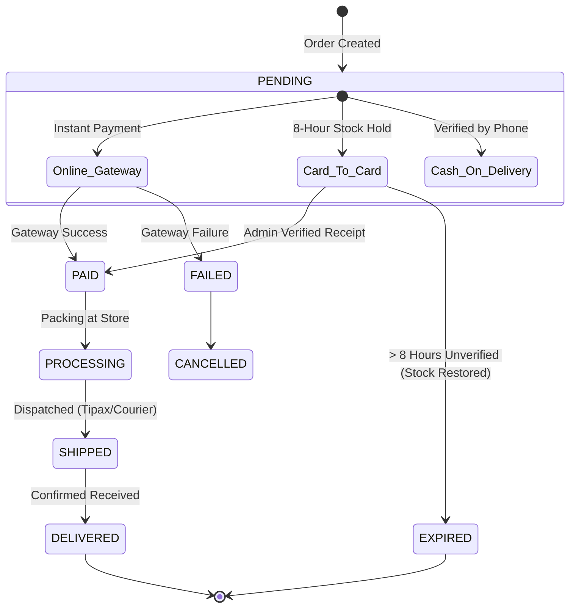

# Data Model: Shiasi Store & Technical Workshop Platform

**Branch**: `001-store-workshop-platform` | **Date**: 2026-09-14 | **Spec**: [spec.md](./spec.md) | **Research**: [research.md](./research.md)

---

## Entity Relationship Overview

---

## 1. Core Data Entities

### User & VerificationToken (Customer Account & Authentication)
- **User**:
  - `id`: `String` (UUID / cuid), Primary Key.
  - `name`: `String?`, Customer full name.
  - `phone`: `String`, Unique, Normalized Iranian mobile (`09XXXXXXXXX`). Indexed.
  - `email`: `String?`, Unique, Optional email address.
  - `password`: `String?`, Optional bcrypt/argon2 password hash for fallback login.
  - `role`: `String`, Default `"CUSTOMER"`. Enum: `CUSTOMER`, `ADMIN`, `TECHNICIAN`.
  - `address`: `String?`, Default delivery address.
  - `city`: `String?`, Default `"نجف‌آباد"`.
  - `postalCode`: `String?`, 10-digit postal code.
  - `nationalCode`: `String?`, 10-digit national code for invoice validation.
  - `companyName`: `String?`, Corporate entity name.
  - `economicCode`: `String?`, 12-digit corporate economic code.
  - `isVerified`: `Boolean`, Default `false`. Set `true` on first successful OTP verification.
  - `createdAt`, `updatedAt`: Timestamps.

- **VerificationToken**:
  - `id`: `String`, Primary Key.
  - `phone`: `String`, Normalized mobile phone.
  - `code`: `String`, 5-digit numeric OTP token.
  - `expiresAt`: `DateTime`, Token expiry timestamp (created + 5 minutes).
  - `resendAttempts`: `Int`, Default `0`. Number of OTP dispatches in current 15-minute window.
  - `cooldownUntil`: `DateTime?`, Cooldown timestamp (now + 60 seconds).
  - `createdAt`: `DateTime`, Creation timestamp.
  - *Indexes*: `@@index([phone, code])`, `@@index([phone, createdAt])`.

---

### Product Catalog & Engineering Specifications
- **Category**:
  - `id`: `String`, Primary Key.
  - `name`: `String`, Persian category display name.
  - `slug`: `String`, Unique URL identifier (e.g. `cooling-heating`, `wiring-building`).
  - `description`: `String?`, SEO description.
  - `icon`: `String?`, Lucide icon identifier.
  - `image`: `String?`, Category visual banner.
  - `sortOrder`: `Int`, Display hierarchy.
  - `createdAt`, `updatedAt`: Timestamps.

- **Product**:
  - `id`: `String`, Primary Key.
  - `name`: `String`, Full Persian product title (e.g. `"الکتروموتور کولر آبی موتوژن ۳/۴ اسب بخار"`).
  - `slug`: `String`, Unique URL slug.
  - `sku`: `String?`, Unique SKU code (e.g. `"MOT-COL-34"`).
  - `mpn`: `String?`, Manufacturer Part Number.
  - `description`: `String`, Rich Markdown product details.
  - `shortDesc`: `String?`, Brief excerpt for card display.
  - `price`: `Int`, Current price in Iranian Toman.
  - `originalPrice`: `Int?`, Pre-discount price in Toman for badge display.
  - `discountPercent`: `Int`, Default `0`.
  - `stock`: `Int`, Available physical stock quantity. Default `10`.
  - `moq`: `Int`, Minimum Order Quantity. Default `1`.
  - `brand`: `String?`, Manufacturer brand (e.g. `"موتوژن"`, `"سیم و کابل البرز"`).
  - `warranty`: `String?`, Warranty terms badge.
  - `madeIn`: `String?`, Country of origin. Default `"ایران"`.
  - `isFeatured`, `isBestSeller`, `isNewArrival`: `Boolean`, Promotional flags.
  - `isIsfahanFast`: `Boolean`, Fast courier delivery flag for Najafabad/Isfahan metro.
  - `datasheetUrl`: `String?`, PDF datasheet download URL.
  - `categoryId`: `String`, Foreign key to `Category`.
  - `createdAt`, `updatedAt`: Timestamps.
  - *Indexes*: `@@index([isFeatured, isBestSeller])`, `@@index([categoryId])`, `@@index([brand])`, `@@index([isArchived])`, `@@index([createdAt])`, `@@index([isArchived, createdAt])`, `@@index([isArchived, price])`, `@@index([isArchived, categoryId])`.

- **ProductSpec**:
  - `id`: `String`, Primary Key.
  - `productId`: `String`, Foreign key to `Product`.
  - `label`: `String`, Technical attribute (e.g. `"ولتاژ کاری"`, `"جنس هادی"`, `"افت ولتاژ مجاز"`).
  - `value`: `String`, Specification metric (e.g. `"220 ولت"`, `"مس خالص آنیل‌شده"`, `"کمتر از ۳ درصد"`).

---

### Orders, Cart & Invoicing (`FEAT-CHECKOUT`)
- **Order**:
  - `id`: `String`, Primary Key.
  - `orderNumber`: `String`, Unique human-readable code: `SH-YYMMDD-XXX` (e.g. `SH-260914-102`).
  - `customerName`: `String`.
  - `customerPhone`: `String`, Normalized Iranian phone.
  - `customerEmail`: `String?`.
  - `userId`: `String?`, Optional reference to authenticated `User`.
  - `province`: `String`, Default `"اصفهان"`.
  - `city`: `String`, Default `"نجف‌آباد"`.
  - `postalCode`: `String?`.
  - `address`: `String`.
  - `isCorporate`: `Boolean`, Default `false`. When `true`, triggers tax-compliant legal invoice generation.
  - `companyName`: `String?`.
  - `economicCode`: `String?`, 12-digit statutory economic code.
  - `nationalCode`: `String?`, 10/11-digit national ID.
  - `shippingMethod`: `String`, Enum: `najafabad_pickup`, `isfahan_express`, `tipax`, `post_pishtaz`.
  - `shippingCost`: `Int`, In Toman.
  - `paymentMethod`: `String`, Enum: `zarinpal`, `cod_isfahan`, `card_to_card`.
  - `paymentStatus`: `String`, Enum: `PENDING`, `PAID`, `FAILED`, `REFUNDED`. Default `PENDING`.
  - `orderStatus`: `String`, Enum: `PENDING`, `PROCESSING`, `SHIPPED`, `DELIVERED`, `CANCELLED`, `EXPIRED`. Default `PENDING`.
  - `trackingCode`: `String?`, Courier or postal tracking identifier.
  - `subtotal`: `Int`, Raw sum of items before tiered discounts in Toman.
  - `discount`: `Int`, Total discount applied (tiered wholesale + coupons) in Toman.
  - `totalAmount`: `Int`, Final payable sum in Toman.
  - `receiptImage`: `String?`, Uploaded card-to-card bank transfer receipt image URL.
  - `reservedUntil`: `DateTime?`, 8-hour reservation window for `card_to_card` orders (`createdAt + 8 hours`).
  - `createdAt`, `updatedAt`: Timestamps.

- **OrderItem**:
  - `id`: `String`, Primary Key.
  - `orderId`: `String`, Foreign key to `Order`.
  - `productId`: `String?`, Foreign key to `Product`.
  - `productName`: `String`.
  - `productImage`: `String?`.
  - `price`: `Int`, Unit price at time of order in Toman.
  - `quantity`: `Int`, Purchased count.
  - `discountPercent`: `Int`, Applied tiered discount (0%, 5% for ≥10, or 10% for ≥50).
  - `total`: `Int`, Line item total after discount in Toman.

---

### Technical Repair Workshop Lifecycle (`FEAT-REPAIR`)
- **RepairRequest**:
  - `id`: `String`, Primary Key.
  - `trackingCode`: `String`, Unique bidirectional-isolated tracking identifier: `REP-YYMMDD-XXXX`.
  - `customerName`: `String`.
  - `customerPhone`: `String`, Normalized Iranian mobile.
  - `userId`: `String?`, Optional reference to registered `User`.
  - `applianceType`: `String`, Enum: `cooler_motor`, `submersible_pump`, `electric_fan`, `quartz_heater`, `antenna`, `electronic_board`, `other`.
  - `brandModel`: `String?`, Manufacturer and model name.
  - `issueDesc`: `String`, Customer's explanation of malfunction.
  - `deliveryType`: `String`, Enum: `in_person` (Workshop drop-off in Najafabad), `courier` (Local courier pickup).
  - `status`: `String`, 7-stage lifecycle:
    - `SUBMITTED`: Request registered online.
    - `RECEIVED`: Physically received at Najafabad workshop.
    - `INSPECTING`: Diagnostics undergoing on workbench.
    - `COST_ESTIMATED`: Diagnostic completed, cost calculated, awaiting approval.
    - `REPAIRING`: Customer approved; replacement parts and rewinding in progress.
    - `READY`: Tested, verified, and ready for pickup/courier delivery.
    - `DELIVERED`: Handed over to customer.
    - `CANCELLED`: Declined by customer or unrepairable.
  - `costApprovalStatus`: `String?`, Enum: `PENDING`, `APPROVED`, `DECLINED`. Default `PENDING`.
  - `approvalChannel`: `String?`, Enum: `PORTAL`, `SMS`, `PHONE`.
  - `approvalTimestamp`: `DateTime?`, Timestamp of approval.
  - `estimatedCost`: `Int?`, In Toman.
  - `finalCost`: `Int?`, In Toman.
  - `adminNotes`: `String?`, Technician diagnostic logs and parts list.
  - `createdAt`, `updatedAt`: Timestamps.

---

### Contractor BOM Submissions & Factory Price Lists
- **BOMSubmission** (`FEAT-BOM-QUOTE`):
  - `id`: `String`, Primary Key.
  - `trackingCode`: `String`, Unique inquiry code: `BOM-YYMMDD-XXX`.
  - `contractorName`: `String`.
  - `contractorPhone`: `String`, Normalized phone.
  - `projectCity`: `String?`, Project location.
  - `companyName`: `String?`, Contracting firm name.
  - `content`: `String?`, Unstructured text list of electrical materials.
  - `fileUrl`: `String?`, Uploaded Excel/PDF sheet URL (max 10MB).
  - `fileType`: `String?`, MIME type (`.xlsx`, `.pdf`, `.csv`).
  - `status`: `String`, Enum: `PENDING`, `QUOTED`, `CONTACTED`, `ARCHIVED`. Default `PENDING`.
  - `adminNotes`: `String?`, Wholesale sales quote notes.
  - `createdAt`, `updatedAt`: Timestamps.

- **ManufacturerPriceList** (`FEAT-PRICE-LISTS`):
  - `id`: `String`, Primary Key.
  - `brand`: `String`, Partner brand name (e.g. `Alborz Cable`, `Motogen`, `Deland`).
  - `title`: `String`, Catalog title (e.g. `"لیست قیمت رسمی سیم و کابل مسی البرز"`).
  - `category`: `String?`, Industry domain.
  - `fileUrl`: `String`, Downloadable PDF URL.
  - `fileSize`: `String?`, Human-readable size (e.g. `"2.4 MB"`).
  - `discountCoeff`: `Float?`, Wholesale discount percentage/coefficient.
  - `publishDateJalali`: `String`, Jalali publication date (e.g. `"شهریور ۱۴۰۳"`).
  - `isActive`: `Boolean`, Default `true`.

---

### Editorial Articles & Knowledge Base (`FEAT-KNOWLEDGE`)
- **Article**:
  - `id`: `String`, Primary Key.
  - `title`: `String`, Persian article headline.
  - `slug`: `String`, Unique URL slug generated from Persian title.
  - `summary`: `String`, SEO summary snippet.
  - `content`: `String`, Rich Markdown text supporting `[!TIP]`, `[!WARNING]`, and tables.
  - `category`: `String`, Technical topic.
  - `tags`: `String`, Comma-separated tags.
  - `readTime`: `String`, Estimated read time (e.g. `"۵ دقیقه مطالعه"`).
  - `image`: `String`, Header hero image URL.
  - `authorName`: `String`, Default `"کارشناس فنی فروشگاه شیاسی"`.
  - `isPublished`: `Boolean`, Default `true`.
  - `views`: `Int`, Read counter. Default `0`.
  - `createdAt`, `updatedAt`: Timestamps.

---

## State Transition Diagrams

### 1. Technical Repair Ticket State Transition

### 2. Order & Card-to-Card Inventory Reservation State Transition

