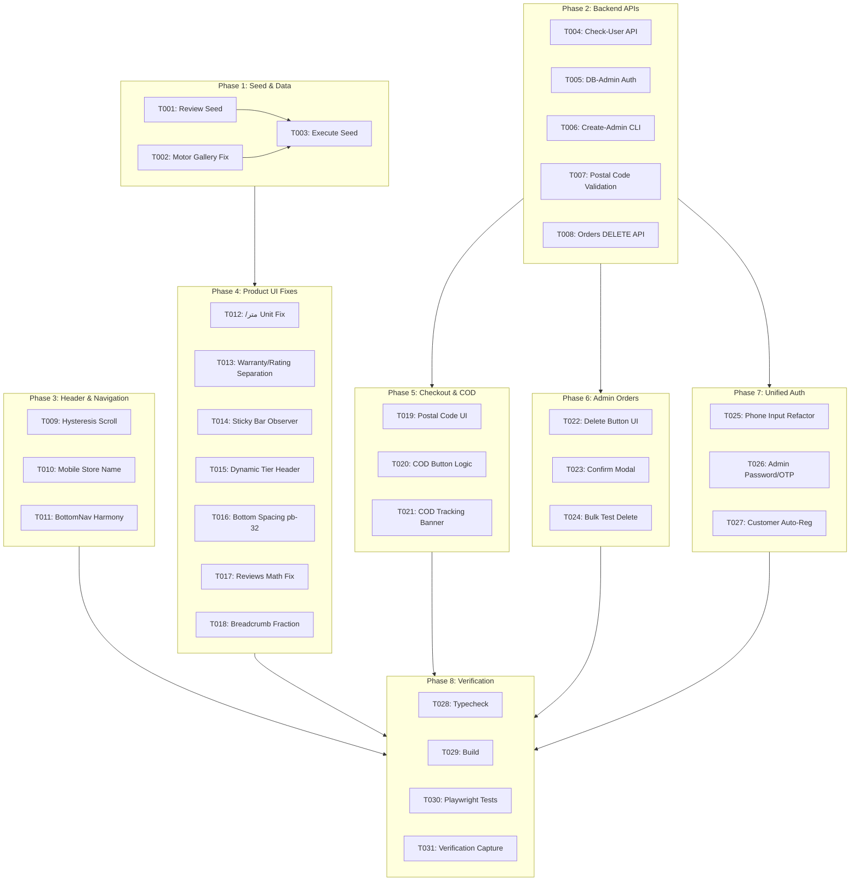

# Tasks: UI/UX Fixes, Product Architecture, Checkout & Unified Authentication

**Feature Branch**: `001-store-workshop-platform`  
**Input Specifications**: [`spec.md`](./spec.md) | [`plan.md`](./plan.md)

---

## Table of Phases

| Phase | Phase Name | Priority | Primary Deliverable |
|---|:---|:---:|:---|
| **Phase 1** | Database Seed & Data Realignment | Foundational | Real reviews seed and accurate motor gallery images |
| **Phase 2** | Backend APIs & Security Architecture | Foundational | Check-user API, DB-backed admin auth, postal validation, and order DELETE endpoint |
| **Phase 3** | Header Navigation & Desktop Jitter Resolution | P1 (MVP) | Hysteresis scroll threshold, mobile store name layout, and z-index harmony |
| **Phase 4** | Product Card, Detail View & Mobile UX Fixes | P1 (MVP) | Fix `/متر` unit, warranty/rating separation, IntersectionObserver sticky bar, and review tab math |
| **Phase 5** | Checkout & Order Tracking UX | P1 | Mandatory 10-digit postal code, COD button logic, and tracking page reassurance |
| **Phase 6** | Admin Orders Management & Sample Deletion | P2 | Single & bulk test order deletion with confirmation modal |
| **Phase 7** | Unified Single-Flow Authentication UI | P2 | Single phone entry, password vs. OTP toggle for admins, auto-registration for customers |
| **Phase 8** | Polish, Build & End-to-End Playwright Verification | Final | TypeScript typecheck, build validation, and Playwright verification across mobile/desktop |

---

## Phase 1: Database Seed & Data Realignment

**Purpose**: Align mock database records with UI expectations so reviews, ratings, and image galleries match actual data.

- [x] T001 [P] Seed real `Review` records in `prisma/seed.js` for Motogen cooler motors to establish parity between `reviewCount` and actual database rows.
- [x] T002 [P] Replace mismatched generator thumbnail for `APP-CLR-MOT75` with authentic cooler motor technical diagram in `prisma/seed.js`.
- [x] T003 Execute database seed via `node prisma/seed.js` to persist corrected review records and motor images.

---

## Phase 2: Backend APIs & Security Architecture

**Purpose**: Core backend endpoints, validation rules, and authentication providers required for UI flows.

- [x] T004 [P] Create `/api/auth/check-user` endpoint in `src/app/api/auth/check-user/route.ts` to inspect phone number role (`ADMIN`/`CUSTOMER`) and password presence.
- [x] T005 [P] Update NextAuth credentials provider in `src/lib/auth.ts` to support database-driven admin password checking and OTP fallback.
- [x] T006 [P] Create admin generation CLI helper script in `scripts/create-admin.js` to promote or create admin accounts with custom credentials.
- [x] T007 Enforce mandatory 10-digit postal code validation (`^\d{10}$`) and COD eligibility check in `src/app/api/checkout/route.ts`.
- [x] T008 Implement `DELETE` method in `src/app/api/admin/orders/route.ts` supporting single order ID deletion and bulk test order cleanup with transaction safety.

---

## Phase 3: Header Navigation & Desktop Jitter Resolution (Priority: P1) 🎯 MVP

**Goal**: Eliminate rapid scroll jitter on desktop, prevent brand name truncation on mobile, and balance header z-index.

**Independent Test**: Scroll past 200px on desktop (1280px) and verify header collapses smoothly without flickering; view mobile header (375px) and verify "فروشگاه شیاسی" displays without truncation.

- [x] T009 [P] [US1] Implement scroll threshold hysteresis (`hide > 160px`, `show < 80px`) in `src/components/layout/Header.tsx` to eliminate infinite collapse/expand flicker loop.
- [x] T010 [P] [US1] Remove restrictive `max-w-[210px]` container on mobile brand link in `src/components/layout/Header.tsx` to prevent store name truncation (`فروشگ...`).
- [x] T011 [US1] Coordinate z-index stacking and safe-area padding between header, `src/components/layout/MobileBottomNav.tsx`, and sticky bars.

---

## Phase 4: Product Card, Detail View & Mobile UX Fixes (Priority: P1) 🎯 MVP

**Goal**: Fix pricing unit bug, separate warranty and rating on mobile cards, eliminate dual add-to-cart buttons, resolve 130% review math, and remove bottom screen occlusion.

**Independent Test**: Open `/products/[slug]` on mobile (375px), verify Motogen motor displays no `/متر`, sticky bar appears only when main purchase card is scrolled out of view, and review textarea + submit button are fully visible and clickable.

- [x] T012 [P] [US2] Fix pricing unit bug in `src/components/product/ProductCard.tsx` so `/متر` only applies when product category is `wiring` or `cable` and explicitly excludes motors/appliances (`سیم‌پیچ`).
- [x] T013 [P] [US2] Rebalance warranty badge and rating star layout in `src/components/product/ProductCard.tsx` to prevent horizontal text collision on mobile screens.
- [x] T014 [US3] Implement `IntersectionObserver` in `src/components/product/ProductDetailView.tsx` to display sticky bottom bar only when main desktop/mobile buy card scrolls out of view.
- [x] T015 [US3] Refactor bulk wholesale tiered discount title in `src/components/product/ProductDetailView.tsx` to dynamically render "متراژ بالا" for cables and "تعداد بالا" for motors/appliances.
- [x] T016 [US3] Add `pb-32 sm:pb-12` bottom padding clearance in `src/components/product/ProductDetailView.tsx` and `src/app/products/[slug]/page.tsx`.
- [x] T017 [US3] Fix review breakdown mathematical percentage bug in `src/components/product/ProductReviewsTab.tsx` so empty reviews default to 0% across all star bars.
- [x] T018 [US3] Preserve Persian fractions (e.g. `۳/۴`) in `src/app/products/[slug]/page.tsx` breadcrumbs by wrapping in `<bdi>` and utilizing horizontal scrolling.

---

## Phase 5: Checkout & Order Tracking UX (Priority: P1)

**Goal**: Enforce 10-digit mandatory postal code, clarify COD payment button, and reassure customers on order tracking.

**Independent Test**: Attempt checkout without postal code or with 9 digits (verify error); select COD (verify button says "ثبت سفارش با پرداخت در محل"); inspect tracking page (verify green reassurance banner).

- [x] T019 [P] [US3] Add red asterisk `*`, strict 10-digit validation, and real-time Persian helper error to postal code input in `src/app/checkout/page.tsx`.
- [x] T020 [US3] Update submit button in `src/app/checkout/page.tsx` to dynamically say "ثبت سفارش با پرداخت در محل" with truck icon when COD is selected, adding courier payment details.
- [x] T021 [US3] Update payment status badge and render prominent green reassurance alert for COD orders in `src/app/order-tracking/[id]/page.tsx`.

---

## Phase 6: Admin Orders Management & Sample Deletion (Priority: P2)

**Goal**: Provide store admins with the capability to delete test/sample orders safely from the dashboard.

**Independent Test**: Log in as admin, navigate to `/admin/orders`, click trash icon on a sample order, confirm modal, verify order is removed and metrics update.

- [x] T022 [P] [US4] Add "حذف سفارش" action button with trash icon to order rows and detail drawer in `src/app/admin/orders/OrdersAdminClient.tsx`.
- [x] T023 [US4] Implement confirmation modal with warning dialog before deleting an order in `src/app/admin/orders/OrdersAdminClient.tsx`.
- [x] T024 [US4] Add one-click "حذف سفارش‌های تستی / نمونه" button to batch clean seed/test orders in `src/app/admin/orders/OrdersAdminClient.tsx`.

---

## Phase 7: Unified Single-Flow Authentication UI (Priority: P2)

**Goal**: Replace separate customer/admin tabs with an intelligent, single phone entry flow supporting password, SMS OTP, and auto-registration.

**Independent Test**: Enter admin phone number (verify option for password or OTP appears); enter regular phone number (verify 5-digit OTP step with 120s timer appears and auto-registers new account).

- [x] T025 [US5] Refactor `src/app/auth/login/page.tsx` to remove manual tab mode switcher in favor of a step-based unified phone input.
- [x] T026 [US5] Integrate `/api/auth/check-user` into `src/app/auth/login/page.tsx` to present password entry or SMS OTP toggle for admins.
- [x] T027 [US5] Implement automatic registration and name intake for new customers upon verifying 5-digit OTP in `src/app/auth/login/page.tsx`.

---

## Phase 8: Polish, Build & End-to-End Playwright Verification (Final)

**Purpose**: Validate that all fixes build without errors and function properly on both mobile and desktop viewports.

- [x] T028 Run TypeScript typecheck via `npm run typecheck` to verify zero compiler errors across all modified components and API routes.
- [x] T029 Execute full production build via `npm run build` to verify Next.js page generation and static/dynamic route compilation.
- [x] T030 Create Playwright / E2E verification test in `tests/e2e-all-phases.test.mjs` covering:
  - Desktop header scroll without jitter
  - Product page mobile layout, correct pricing unit (no `/متر`), and `IntersectionObserver` sticky bar
  - Review tab form accessibility and visibility above bottom nav
  - Mandatory postal code validation in checkout
  - Cash on delivery button state and tracking reassurance banner
- [x] T031 Run Playwright / E2E test suite using command runner and capture verification screenshots.

---

## Dependencies & Execution Order

