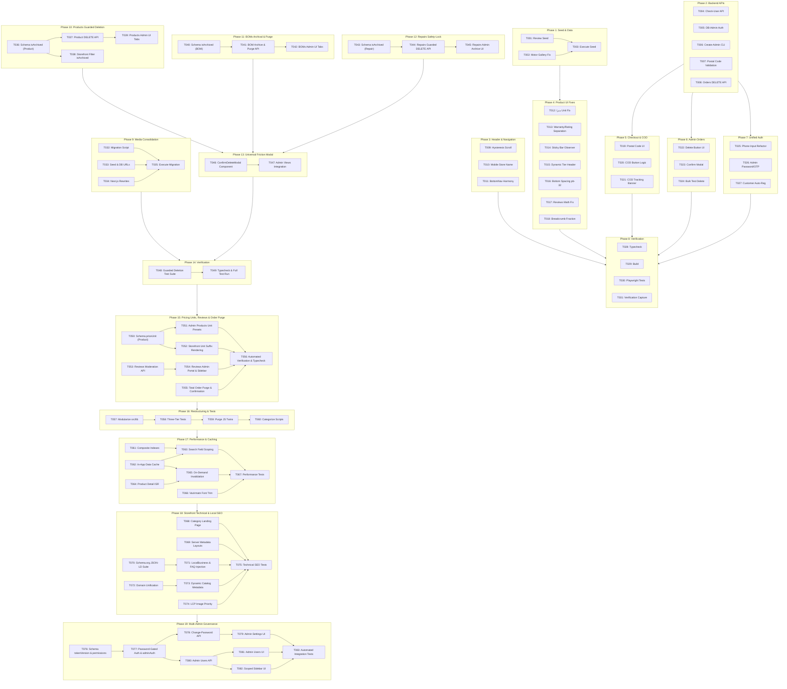

# Tasks: UI/UX Fixes, Product Architecture, Checkout & Unified Authentication

**Feature Branch**: `001-store-workshop-platform`  
**Input Specifications**: [`spec.md`](./spec.md) | [`plan.md`](./plan.md)

---

## Table of Phases

| Phase | Phase Name | Priority | Primary Deliverable |
|---|:---|:---:|:---|
| **Phase 1** | Database Seed & Data Realignment | Foundational | Real reviews seed and accurate motor gallery images |
| **Phase 2** | Backend APIs & Security Architecture | Foundational | Check-user API, DB-backed admin auth, postal validation, and order DELETE endpoint |
| **Phase 3** | Header Navigation & Desktop Jitter Resolution | P1 (MVP) | Hysteresis scroll threshold, mobile store name layout, and z-index harmony |
| **Phase 4** | Product Card, Detail View & Mobile UX Fixes | P1 (MVP) | Fix `/متر` unit, warranty/rating separation, IntersectionObserver sticky bar, and review tab math |
| **Phase 5** | Checkout & Order Tracking UX | P1 | Mandatory 10-digit postal code, COD button logic, and tracking page reassurance |
| **Phase 6** | Admin Orders Management & Sample Deletion | P2 | Single & bulk test order deletion with confirmation modal |
| **Phase 7** | Unified Single-Flow Authentication UI | P2 | Single phone entry, password vs. OTP toggle for admins, auto-registration for customers |
| **Phase 8** | Polish, Build & End-to-End Playwright Verification | Final | TypeScript typecheck, build validation, and Playwright verification across mobile/desktop |
| **Phase 9** | Product Media Assets Consolidation & Next.js Rewrites | Foundational | Single uploads folder, seed URL updates, and Next.js backward-compatible rewrites |
| **Phase 10** | Products Smart Guarded Deletion | P2 | Safe order-history check, archive transition vs hard delete, and admin catalog tabs |
| **Phase 11** | BOM Inquiries Two-Stage Archival & Purge | P2 | Inquiries archive toggle, restore action, and permanent disk purge with Excel unlinking |
| **Phase 12** | Workshop Repairs Safety-Locked Archival | P2 | Active repair protection, technical history archive, and terminal ticket deletion |
| **Phase 13** | Universal Smart Friction Deletion Modal & WCAG | P2 | Count-aware friction modal (type "حذف" >3 items), keyboard trap, and accessible alerts |
| **Phase 14** | Automated Verification & Full Test Suite | Final | End-to-end integration tests for image routing, guarded deletion, and full system typecheck |
| **Phase 15** | Optional Pricing Units, Customer Reviews Moderation & Total Order Purge | P1 | priceUnit presets/rendering, /admin/reviews portal, and total order purge cascade |
| **Phase 16** | Codebase Deep-Module Restructuring & Test Consolidation | Architectural | Deep submodules in src/lib/, root facades, three-tier tests, and categorized scripts |
| **Phase 17** | Storefront In-App Performance Optimization & Database Indexing | P1 | In-app Data Cache, product detail ISR, composite DB indexes, and font trimming |
| **Phase 18** | Storefront Technical & Local SEO Optimization | P1 | Category landing pages, layout metadata, Schema.org suite, and LCP priority |
| **Phase 19** | Multi-Admin Governance, Scoped Permissions & Session Revocation | P1 | TokenVersion invalidation, password-gated auth, /admin/settings, and /admin/users console |

---

## Phase 1: Database Seed & Data Realignment

**Purpose**: Align mock database records with UI expectations so reviews, ratings, and image galleries match actual data.

- [x] T001 [P] Seed real `Review` records in `prisma/seed.js` for Motogen cooler motors to establish parity between `reviewCount` and actual database rows.
- [x] T002 [P] Replace mismatched generator thumbnail for `APP-CLR-MOT75` with authentic cooler motor technical diagram in `prisma/seed.js`.
- [x] T003 Execute database seed via `node prisma/seed.js` to persist corrected review records and motor images.

---

## Phase 2: Backend APIs & Security Architecture

**Purpose**: Core backend endpoints, validation rules, and authentication providers required for UI flows.

- [x] T004 [P] Create `/api/auth/check-user` endpoint in `src/app/api/auth/check-user/route.ts` to inspect phone number role (`ADMIN`/`CUSTOMER`) and password presence.
- [x] T005 [P] Update NextAuth credentials provider in `src/lib/auth.ts` to support database-driven admin password checking and OTP fallback.
- [x] T006 [P] Create admin generation CLI helper script in `scripts/create-admin.js` to promote or create admin accounts with custom credentials.
- [x] T007 Enforce mandatory 10-digit postal code validation (`^\d{10}$`) and COD eligibility check in `src/app/api/checkout/route.ts`.
- [x] T008 Implement `DELETE` method in `src/app/api/admin/orders/route.ts` supporting single order ID deletion and bulk test order cleanup with transaction safety.

---

## Phase 3: Header Navigation & Desktop Jitter Resolution (Priority: P1) 🎯 MVP

**Goal**: Eliminate rapid scroll jitter on desktop, prevent brand name truncation on mobile, and balance header z-index.

**Independent Test**: Scroll past 200px on desktop (1280px) and verify header collapses smoothly without flickering; view mobile header (375px) and verify "فروشگاه شیاسی" displays without truncation.

- [x] T009 [P] [US1] Implement scroll threshold hysteresis (`hide > 160px`, `show < 80px`) in `src/components/layout/Header.tsx` to eliminate infinite collapse/expand flicker loop.
- [x] T010 [P] [US1] Remove restrictive `max-w-[210px]` container on mobile brand link in `src/components/layout/Header.tsx` to prevent store name truncation (`فروشگ...`).
- [x] T011 [US1] Coordinate z-index stacking and safe-area padding between header, `src/components/layout/MobileBottomNav.tsx`, and sticky bars.

---

## Phase 4: Product Card, Detail View & Mobile UX Fixes (Priority: P1) 🎯 MVP

**Goal**: Fix pricing unit bug, separate warranty and rating on mobile cards, eliminate dual add-to-cart buttons, resolve 130% review math, and remove bottom screen occlusion.

**Independent Test**: Open `/products/[slug]` on mobile (375px), verify Motogen motor displays no `/متر`, sticky bar appears only when main purchase card is scrolled out of view, and review textarea + submit button are fully visible and clickable.

- [x] T012 [P] [US2] Fix pricing unit bug in `src/components/product/ProductCard.tsx` so `/متر` only applies when product category is `wiring` or `cable` and explicitly excludes motors/appliances (`سیم‌پیچ`).
- [x] T013 [P] [US2] Rebalance warranty badge and rating star layout in `src/components/product/ProductCard.tsx` to prevent horizontal text collision on mobile screens.
- [x] T014 [US3] Implement `IntersectionObserver` in `src/components/product/ProductDetailView.tsx` to display sticky bottom bar only when main desktop/mobile buy card scrolls out of view.
- [x] T015 [US3] Refactor bulk wholesale tiered discount title in `src/components/product/ProductDetailView.tsx` to dynamically render "متراژ بالا" for cables and "تعداد بالا" for motors/appliances.
- [x] T016 [US3] Add `pb-32 sm:pb-12` bottom padding clearance in `src/components/product/ProductDetailView.tsx` and `src/app/products/[slug]/page.tsx`.
- [x] T017 [US3] Fix review breakdown mathematical percentage bug in `src/components/product/ProductReviewsTab.tsx` so empty reviews default to 0% across all star bars.
- [x] T018 [US3] Preserve Persian fractions (e.g. `۳/۴`) in `src/app/products/[slug]/page.tsx` breadcrumbs by wrapping in `<bdi>` and utilizing horizontal scrolling.

---

## Phase 5: Checkout & Order Tracking UX (Priority: P1)

**Goal**: Enforce 10-digit mandatory postal code, clarify COD payment button, and reassure customers on order tracking.

**Independent Test**: Attempt checkout without postal code or with 9 digits (verify error); select COD (verify button says "ثبت سفارش با پرداخت در محل"); inspect tracking page (verify green reassurance banner).

- [x] T019 [P] [US3] Add red asterisk `*`, strict 10-digit validation, and real-time Persian helper error to postal code input in `src/app/checkout/page.tsx`.
- [x] T020 [US3] Update submit button in `src/app/checkout/page.tsx` to dynamically say "ثبت سفارش با پرداخت در محل" with truck icon when COD is selected, adding courier payment details.
- [x] T021 [US3] Update payment status badge and render prominent green reassurance alert for COD orders in `src/app/order-tracking/[id]/page.tsx`.

---

## Phase 6: Admin Orders Management & Sample Deletion (Priority: P2)

**Goal**: Provide store admins with the capability to delete test/sample orders safely from the dashboard.

**Independent Test**: Log in as admin, navigate to `/admin/orders`, click trash icon on a sample order, confirm modal, verify order is removed and metrics update.

- [x] T022 [P] [US4] Add "حذف سفارش" action button with trash icon to order rows and detail drawer in `src/app/admin/orders/OrdersAdminClient.tsx`.
- [x] T023 [US4] Implement confirmation modal with warning dialog before deleting an order in `src/app/admin/orders/OrdersAdminClient.tsx`.
- [x] T024 [US4] Add one-click "حذف سفارش‌های تستی / نمونه" button to batch clean seed/test orders in `src/app/admin/orders/OrdersAdminClient.tsx`.

---

## Phase 7: Unified Single-Flow Authentication UI (Priority: P2)

**Goal**: Replace separate customer/admin tabs with an intelligent, single phone entry flow supporting password, SMS OTP, and auto-registration.

**Independent Test**: Enter admin phone number (verify option for password or OTP appears); enter regular phone number (verify 5-digit OTP step with 120s timer appears and auto-registers new account).

- [x] T025 [US5] Refactor `src/app/auth/login/page.tsx` to remove manual tab mode switcher in favor of a step-based unified phone input.
- [x] T026 [US5] Integrate `/api/auth/check-user` into `src/app/auth/login/page.tsx` to present password entry or SMS OTP toggle for admins.
- [x] T027 [US5] Implement automatic registration and name intake for new customers upon verifying 5-digit OTP in `src/app/auth/login/page.tsx`.

---

## Phase 8: Polish, Build & End-to-End Playwright Verification (Final)

**Purpose**: Validate that all fixes build without errors and function properly on both mobile and desktop viewports.

- [x] T028 Run TypeScript typecheck via `npm run typecheck` to verify zero compiler errors across all modified components and API routes.
- [x] T029 Execute full production build via `npm run build` to verify Next.js page generation and static/dynamic route compilation.
- [x] T030 Create Playwright / E2E verification test in `tests/e2e-all-phases.test.mjs` covering:
  - Desktop header scroll without jitter
  - Product page mobile layout, correct pricing unit (no `/متر`), and `IntersectionObserver` sticky bar
  - Review tab form accessibility and visibility above bottom nav
  - Mandatory postal code validation in checkout
  - Cash on delivery button state and tracking reassurance banner
- [x] T031 Run Playwright / E2E test suite using command runner and capture verification screenshots.

---

## Phase 9: Product Media Assets Consolidation & Next.js Rewrites (Foundational)

**Goal**: Consolidate product image assets into `/public/uploads/products/` as the single source of truth, update database seed references, and configure transparent Next.js rewrites for zero broken images.

**Independent Test**: Request `/images/products/alborz-cable-1.jpg` and `/uploads/products/alborz-cable-1.jpg` in browser/curl, verify both return HTTP 200 and identical image bytes.

- [x] T032 [P] Create migration script `scripts/migrate-images.js` to copy/move images from root `/Images` and `/public/images/products` into `/public/uploads/products/`
- [x] T033 [P] Update image references in `prisma/seed.js` and database rows (`ProductImage.url`, `Category.image`) to use `/uploads/products/...`
- [x] T034 [P] Configure transparent Next.js URL rewrite in `next.config.ts` mapping `/images/products/:path*` to `/uploads/products/:path*`
- [x] T035 Execute image migration script `scripts/migrate-images.js` and clean up empty redundant source directories

---

## Phase 10: Products Smart Guarded Deletion (Priority: P2)

**Goal**: Implement smart guarded deletion for products: permanently delete products with zero orders along with disk images; archive products with historical order items (`isArchived: true`) to preserve financial/order integrity.

**Independent Test**: Attempt deleting a zero-order product (verify hard delete from DB); attempt deleting a product with 1+ orders (verify status transitions to `isArchived: true` and stock becomes 0); query public catalog (verify archived item is excluded); view admin catalog (verify item appears under "آرشیو شده‌ها").

- [x] T036 [P] Add `isArchived Boolean @default(false)` to `Product` model in `prisma/schema.prisma` and push schema via `npx prisma db push`
- [x] T037 [US9] Implement `DELETE /api/admin/products` and `DELETE /api/admin/products/[id]` with `OrderItem` count check (hard delete + image unlink if 0 orders; `isArchived: true` if >=1 orders) in `src/app/api/admin/products/route.ts` and `src/app/api/admin/products/[id]/route.ts`
- [x] T038 [US9] Update public catalog queries in `src/app/products/page.tsx`, `src/app/products/[slug]/page.tsx`, and `src/app/api/search/route.ts` to filter `where: { isArchived: false }`
- [x] T039 [US9] Update `src/app/admin/products/ProductsAdminClient.tsx` with single/bulk deletion actions, summary badge feedback, and active vs. archived catalog view tabs

---

## Phase 11: BOM Inquiries Two-Stage Archival & Purge (Priority: P2)

**Goal**: Provide a two-stage archival and purge workflow for contractor Bill of Materials (BOM) inquiries, protecting active submissions while permitting permanent purging of physical Excel/PDF files.

**Independent Test**: Move an inquiry to archive (verify `isArchived: true` and file preserved on disk); click restore (verify `isArchived: false`); click permanent purge in archive tab (verify DB row deleted and uploaded file deleted from disk).

- [x] T040 [P] Add `isArchived Boolean @default(false)` to `BOMSubmission` model in `prisma/schema.prisma` and push schema via `npx prisma db push`
- [x] T041 [US9] Implement `PATCH /api/admin/boms/[id]/archive` (toggle archive) and `DELETE /api/admin/boms/[id]` (permanent purge with physical Excel file unlinking from `public/uploads/boms/`) in `src/app/api/admin/boms/[id]/archive/route.ts` and `src/app/api/admin/boms/[id]/route.ts`
- [x] T042 [US9] Update `src/app/admin/boms/BomsAdminClient.tsx` with segmented tabs (active vs. archived), 1-click restore action, and permanent purge confirmation modal

---

## Phase 12: Workshop Repairs Safety-Locked Archival (Priority: P2)

**Goal**: Safeguard active workshop repair jobs from deletion, while routing completed and cancelled tickets to a searchable technical history archive with restricted permanent purge.

**Independent Test**: Attempt deleting a repair ticket in `INSPECTING` status (verify HTTP 400 error and rejection); complete the ticket and delete (verify transition to `isArchived: true` in technical archive); purge terminal ticket from archive view (verify record removed).

- [x] T043 [P] Add `isArchived Boolean @default(false)` to `RepairRequest` model in `prisma/schema.prisma` and push schema via `npx prisma db push`
- [x] T044 [US9] Implement `DELETE /api/admin/repairs/[id]` in `src/app/api/admin/repairs/[id]/route.ts` and bulk delete in `src/app/api/admin/repairs/route.ts` rejecting in-progress stages (`INSPECTING`, `COST_ESTIMATED`, `REPAIRING`, `READY`) and allowing deletion only for terminal states (`COMPLETED`, `CANCELLED`)
- [x] T045 [US9] Update `src/app/admin/repairs/RepairsAdminClient.tsx` with disabled delete tooltip on active repairs, a dedicated "بایگانی سوابق فنی کارگاه" tab, and permanent purge modal

---

## Phase 13: Universal Smart Friction Deletion Modal & WCAG (Priority: P2)

**Goal**: Deliver a WCAG-compliant, Persian-friction confirmation modal across all admin views (Orders, Products, BOMs, Repairs) requiring text confirmation ("حذف") for large batches or "Delete All".

**Independent Test**: Select 2 items for deletion (verify standard red confirmation modal); select 5 items or "Delete All" (verify button is disabled until typing "حذف"); press `Escape` or tab through (verify focus trap and clean dismissal).

- [x] T046 [P] [US9] Create reusable component `src/components/admin/ConfirmDeleteModal.tsx` with count-aware friction (standard confirmation for 1-3 items; type "حذف" for >3 items or "Delete All"), Escape dismiss, and focus trap
- [x] T047 [US9] Integrate `ConfirmDeleteModal` into Orders, Products, BOMs, and Repairs admin client views in `src/app/admin/orders/OrdersAdminClient.tsx`, `src/app/admin/products/ProductsAdminClient.tsx`, `src/app/admin/boms/BomsAdminClient.tsx`, and `src/app/admin/repairs/RepairsAdminClient.tsx`

---

## Phase 14: Automated Verification & Full Test Suite (Final)

**Purpose**: Execute end-to-end integration tests for media migration rewrites, guarded deletions across entities, and full system typecheck.

- [x] T048 Create integration test suite in `tests/phase9-guarded-deletion.test.mjs` covering image rewrites, product order-guard checks, BOM file deletion, and repair status protection
- [x] T049 Execute `npm run typecheck`, `npm test`, and `npx tsx tests/phase9-guarded-deletion.test.mjs` to verify zero errors across all phases

---

## Phase 15: Optional Pricing Units, Customer Reviews Moderation & Total Order Purge (Priority: P1)

**Goal**: Deliver configurable product pricing units (`priceUnit`) with admin chips and storefront conditional rendering, a complete customer reviews moderation system at `/admin/reviews` with 1-click verification/purging and rating recomputation, and dual order purge workflows (samples vs total database purge) with high-friction confirmation.

**Independent Test**:
1. In admin product editor, select "متر" chip, save; verify storefront card and product detail display `/متر`. Edit and clear unit; verify clean currency without suffix.
2. In customer reviews tab, submit a review; verify it appears in `/admin/reviews` under "در انتظار بررسی"; click "تایید نظر"; verify review appears on product page and rating recalculates; click "حذف نظر"; verify review is purged and rating recalculates.
3. In admin orders table, click "حذف تمامی سفارش‌های سیستم"; verify `ConfirmDeleteModal` requires typing "حذف" and confirming deletes all orders and cascaded items cleanly.

- [x] T050 [US1] [US9] Extend `Product` model in `prisma/schema.prisma` with optional field `priceUnit String?` and synchronize PostgreSQL schema via `npx prisma db push`
- [x] T051 [US9] Update `src/app/admin/products/ProductsAdminClient.tsx` and `src/app/api/admin/products/route.ts` with quick preset chips (`عدد`, `متر`, `کلاف`, `شاخه`, `کیلوگرم`, `بسته`) and custom text input for `priceUnit`
- [x] T052 [US1] Update `src/components/product/ProductCard.tsx`, `src/app/products/[slug]/ProductDetailView.tsx`, and mobile sticky purchase bar to conditionally render `/{product.priceUnit}` when present and omit suffix when null
- [x] T053 [P] [US9] Create customer review moderation API route `src/app/api/admin/reviews/route.ts` supporting `GET` (filter by pending/approved), `PATCH` (toggle `isVerified` and recompute product average rating and review count), and `DELETE` (purge abusive review and recompute product rating)
- [x] T054 [US9] Create administrative reviews moderation console in `src/app/admin/reviews/page.tsx` and `src/app/admin/reviews/ReviewsAdminClient.tsx` with filter tabs ("در انتظار بررسی", "تایید شده‌ها", "همه"), rating badges, 1-click approve/deny/delete actions, and register `/admin/reviews` link in `src/components/admin/AdminSidebar.tsx`
- [x] T055 [P] [US9] Enhance `src/app/api/admin/orders/route.ts` to support `{ deleteAllOrders: true }` cascade purge, and update `src/app/admin/orders/OrdersAdminClient.tsx` with dual purge buttons ("حذف سفارش‌های تستی / نمونه" and "حذف تمامی سفارش‌های سیستم") guarded by `ConfirmDeleteModal`
- [x] T056 [US9] Create automated integration test `tests/phase15-reviews-and-order-purge.test.mjs`, run full `npm run typecheck` and `npm test` to verify zero regressions

---

## Phase 16: Codebase Deep-Module Restructuring & Test Consolidation (Architectural)

**Goal**: Restructure `src/lib/` into deep domain packages (`core/`, `domain/`, `admin/`, `utils/`) with zero-breakage root facades, consolidate tests into a clean three-tier structure under `tests/`, purge redundant compiled `.js` twins, and categorize operational scripts into `scripts/migrations/`, `scripts/seeds/`, and `scripts/tools/`.

- [x] T057 [P] Modularize `src/lib/` into focused subpackages (`core/`, `domain/`, `admin/`, `utils/`) and provide root facade re-exports in `src/lib/index.ts`
- [x] T058 [P] Consolidate unit, integration, and E2E tests under `tests/` (`tests/unit/`, `tests/integration/`, `tests/e2e/`), update `package.json` scripts (`test`, `test:unit`, `test:integration`), and prune `src/lib/__tests__/`
- [x] T059 [P] Delete redundant compiled `.js` twin files from `src/lib/` and configure all test suites to import `.ts` source modules directly via `tsx`
- [x] T060 Organize scripts into categorized subdirectories (`scripts/migrations/`, `scripts/seeds/`, `scripts/tools/`) and update `package.json` command triggers

---

## Phase 17: Storefront In-App Performance Optimization & Database Indexing (Priority: P1)

**Goal**: Deliver sub-100ms storefront catalog response times, eliminate PostgreSQL sequential table scans, and reduce mobile data consumption using Next.js 15 native in-app Data Cache (`unstable_cache`), product detail ISR (`revalidate = 300`) with `generateStaticParams`, targeted composite database indexes, commercial search scoping, and mobile Vazirmatn font weight trimming.

**Independent Test**:
1. Run `npx prisma db push`; verify PostgreSQL composite indexes `[isArchived, createdAt]`, `[isArchived, price]`, and `[isArchived, categoryId]` exist.
2. Query `/products`; verify category counts and brand listings are served from in-app Data Cache in < 100ms.
3. Perform a multi-token Persian search; verify search queries commercial attributes (`name`, `sku`, `mpn`, `brand`, `shortDesc`) and excludes heavy HTML descriptions.
4. Open a product detail page (`/products/[slug]`); verify static pre-rendering via `generateStaticParams` and sub-30ms ISR cache response.
5. In `/admin/products`, update a product price; verify `revalidateTag('catalog-metadata')` and `revalidatePath('/products/[slug]')` immediately update the storefront price.
6. Inspect `src/app/layout.tsx`; verify Vazirmatn font loads exactly 4 core weights (`400`, `500`, `700`, `900`) with `display: "swap"`.

- [x] T061 [P] [US1] Add composite indexes on `Product` in `prisma/schema.prisma` (`@@index([isArchived, createdAt])`, `@@index([isArchived, price])`, `@@index([isArchived, categoryId])`) and push to database via `npx prisma db push`
- [x] T062 [P] [US1] Implement cached catalog metadata helper `getCachedCatalogMetadata()` in `src/lib/domain/catalog-cache.ts` using Next.js `unstable_cache` with tag `['catalog-metadata']` for category product counts and distinct brands
- [x] T063 [US1] Refactor `src/app/products/page.tsx` to consume `getCachedCatalogMetadata()` and scope multi-token search queries to `name`, `sku`, `mpn`, `brand`, and `shortDesc`, omitting raw HTML `description` scans
- [x] T064 [US1] Configure ISR (`export const revalidate = 300`) and export `generateStaticParams()` in `src/app/products/[slug]/page.tsx` for active product catalog pre-rendering
- [x] T065 [P] [US9] Implement programmatic on-demand cache invalidation (`revalidateTag('catalog-metadata')` and `revalidatePath('/products/[slug]')`) inside administrative mutation handlers `src/app/api/admin/products/route.ts` and `src/app/api/admin/categories/route.ts`
- [x] T066 [P] [US1] Trim Vazirmatn Google font configuration in `src/app/layout.tsx` to 4 essential weights (`["400", "500", "700", "900"]`) with `display: "swap"` and `preload: true`
- [x] T067 [US1] Create automated performance and in-app caching integration test in `tests/integration/phase17-performance-and-caching.test.mjs`, verifying tag invalidation, composite index queries, and run `npm run typecheck` and `npm test`

---

## Phase 18: Storefront Technical & Local SEO Optimization (Priority: P1)

**Goal**: Eliminate 404 crawl errors on category URLs, optimize Google Core Web Vitals (LCP) and local search indexing with dedicated category landing pages, server layout metadata for client interactive routes, LocalBusiness / FAQPage / Breadcrumb Schema.org JSON-LD suite, dynamic catalog metadata with clean canonicals, and image priority flags.

**Independent Test**:
1. Navigate to `/categories/[slug]` (e.g. `/categories/cables`); verify page returns 200, displays category H1, breadcrumbs, filtered products, and valid `BreadcrumbList` schema.
2. Inspect headers/source of `/repair-service`, `/contact`, `/faq`, `/price-lists`, and `/bom-upload`; verify server `layout.tsx` generates accurate meta title, description, canonical link, and OpenGraph tags.
3. Inspect root page source; verify `ElectronicsStore` / `LocalBusiness` JSON-LD schema renders with Najafabad NAP (`03142626116`, `32.6365457, 51.3551911`).
4. Inspect `/faq` and `/repair-service`; verify `FAQPage` JSON-LD schema renders with questions and answers.
5. In `/products`, query with filters (e.g. `?brand=البرز`); verify dynamic `title` is generated and `canonical` URL points to `/products`.
6. Inspect product detail page; verify primary product image has `priority` attribute.
7. Run `npm test` and `npm run typecheck`; verify all test suites pass.

- [x] T068 [P] [US1] Create dedicated category landing page at `src/app/categories/[slug]/page.tsx` with dynamic `generateMetadata`, H1, category description, breadcrumb navigation, and pre-filtered `ProductCard` grid
- [x] T069 [P] [US1] Add server-side `layout.tsx` files exporting localized `Metadata` with Persian titles, descriptions, canonical URLs, and OpenGraph definitions for client routes: `src/app/repair-service/layout.tsx`, `src/app/contact/layout.tsx`, `src/app/faq/layout.tsx`, `src/app/price-lists/layout.tsx`, and `src/app/bom-upload/layout.tsx`
- [x] T070 [P] [US1] Create JSON-LD schema builder and component `src/components/seo/JsonLd.tsx` supporting `ElectronicsStore`, `FAQPage`, and `BreadcrumbList` schemas
- [x] T071 [US1] Inject `ElectronicsStore` structured data with Najafabad NAP in root layout/homepage, and inject `FAQPage` structured data in `/faq` and `/repair-service`
- [x] T072 [US1] Unify domain resolution across `src/app/products/[slug]/page.tsx`, `src/app/sitemap.ts`, and `src/app/robots.ts` to strictly consume `process.env.NEXT_PUBLIC_APP_URL || "https://shiasi-electric.ir"`
- [x] T073 [US1] Implement dynamic `generateMetadata` in `src/app/products/page.tsx` with filter-aware titles and canonical self-referencing `/products`
- [x] T074 [US1] Add `priority` property to primary product detail image in `src/components/product/ProductDetailView.tsx` and hero banners to optimize Largest Contentful Paint (LCP)
- [x] T075 [US1] Create automated technical SEO integration test suite `tests/integration/phase18-technical-seo.test.mjs` and execute `npm run typecheck` and `npm test`

---

## Phase 19: Multi-Admin Governance, Scoped Permissions & Session Revocation (Priority: P1)

**Goal**: Implement multi-admin team governance, enabling the Root Owner (`ADMIN_PHONES`) to provision secondary administrators with dynamically scoped module permissions (`CATALOG`, `ORDERS`, `REPAIRS`, `REVIEWS`), self-service password rotation with timing-safe validation, global session invalidation across secondary devices via `tokenVersion`, and strict password-gated administrative authentication.

**Independent Test**:
1. Run `npx prisma db push` to verify `tokenVersion`, `adminPermissions`, and `isSuspended` columns in PostgreSQL.
2. Sign in via `/auth/login` using an administrative phone number with SMS OTP alone; verify the granted session role is strictly `CUSTOMER` and `/admin` access is rejected (FR-067).
3. Sign in via `/auth/login` using Phone + Password as Root Owner (`09136260072`); verify access to `/admin` and visibility of all modules including `/admin/users`.
4. On Browser A, navigate to `/admin/settings` and rotate the password with a valid 8+ char alphanumeric string; verify active session remains valid, `tokenVersion` increments in PostgreSQL, eye toggle is positioned at inline-start `left-3` in RTL, and focus rings/tap targets adhere to UI/UX Pro Max.
5. On Browser B (logged in prior to password rotation), attempt an administrative API request; verify HTTP 401 Unauthorized is returned and the stale session is immediately terminated (FR-065).
6. As Root Owner in `/admin/users`, provision a secondary administrator with permissions `["REPAIRS"]`, requiring Root Password re-authentication; sign in as the secondary admin and verify that only the "تعمیرات کارگاه" and "تنظیمات" links are visible in the sidebar, and direct navigation to `/admin/orders` returns 403 Forbidden (FR-063, FR-064).
7. As Root Owner, toggle suspension on the secondary admin; verify `isSuspended: true` and `tokenVersion` increments atomically, immediately terminating the secondary admin's active session on their next request.
8. Attempt to delete or demote the Root Owner account in `/admin/users`; verify the action is strictly blocked (FR-063).
9. Run automated test suite `tests/integration/phase19-admin-governance.test.mjs` and execute `npm run typecheck`; verify all contract and security checks pass cleanly.

- [x] T076 [P] [US9] Add `tokenVersion Int @default(0)`, `adminPermissions String?`, and `isSuspended Boolean @default(false)` fields to the `User` model in `prisma/schema.prisma` and synchronize PostgreSQL schema via `npx prisma db push`
- [x] T077 [US9] Update `src/lib/core/auth.ts` to enforce password-gated admin authentication (disallowing role escalation from OTP), embed `tokenVersion` and `permissions` in NextAuth JWT and session callbacks, and update `src/lib/core/adminAuth.ts` with `tokenVersion` session revocation verification and `checkAdminPermission(session, module)`
- [x] T078 [P] [US9] Implement `POST /api/admin/change-password` in `src/app/api/admin/change-password/route.ts` with timing-safe current password verification (`crypto.timingSafeEqual`), complexity validation (minimum 8 characters with letters and numbers), sliding-window rate limiting (5 attempts/15 min), atomic `tokenVersion` increment, and salted scrypt hashing via `src/lib/core/password.ts`
- [x] T079 [US9] Build self-service password rotation interface at `/admin/settings` (`src/app/admin/settings/page.tsx` and `src/app/admin/settings/AdminSettingsClient.tsx`) adhering to UI/UX Pro Max standards: visible `<label htmlFor>`, `role="alert"` for error announcements, 44×44px minimum tap targets, eye toggle at inline-start `left-3` in RTL layout with Persian `aria-label`, visible focus rings (`focus:ring-2 focus:ring-primary-500`), and live strength meter
- [x] T080 [P] [US9] Implement administrative users API route handlers (`GET`, `POST`, `PATCH`, `DELETE`) in `src/app/api/admin/users/route.ts` and `src/app/api/admin/users/[id]/route.ts` with Root Owner (`ADMIN_PHONES`) exclusivity, immutable SuperAdmin guard, mandatory Root Password re-authentication, and automatic `tokenVersion` increment on suspension (`isSuspended: true`) for immediate global session invalidation
- [x] T081 [US9] Build administrative governance portal at `/admin/users` (`src/app/admin/users/page.tsx` and `src/app/admin/users/AdminUsersClient.tsx`) with UI/UX Pro Max compliance: phone numbers wrapped in `<bdi dir="ltr" className="font-mono">`, scoped module assignment chips (`CATALOG`, `ORDERS`, `REPAIRS`, `REVIEWS`), active/suspended badges, and a focus-trapped, keyboard-escapable (`Escape` key) modal dialog (`role="dialog"`, `aria-modal="true"`) requiring Root Password re-auth verification
- [x] T082 [US9] Update `src/components/admin/AdminSidebar.tsx` to inspect `session.user.permissions` and dynamically render only permitted domain modules for secondary admins, hiding unauthorized sections and displaying Settings for all admins
- [x] T083 [US9] Create automated integration test suite `tests/integration/phase19-admin-governance.test.mjs` verifying password rotation, tokenVersion session invalidation, scoped module access denial (403), Root Owner protection, and OTP elevation rejection, followed by clean `npm run typecheck`

---

## Dependencies & Execution Order



---

## Parallel Execution Opportunities (Phase 19)

```bash
# Schema and database push:
Task T076: "Add tokenVersion, adminPermissions, and isSuspended to User in prisma/schema.prisma"

# Parallel backend APIs once auth core is updated (T077):
Task T078: "Implement POST /api/admin/change-password in src/app/api/admin/change-password/route.ts"
Task T080: "Implement administrative users API route handlers in src/app/api/admin/users/route.ts"

# Parallel UI components once API contracts are ready:
Task T079: "Build self-service password rotation interface in src/app/admin/settings/"
Task T081: "Build administrative governance portal in src/app/admin/users/"
Task T082: "Update src/components/admin/AdminSidebar.tsx for dynamic scoped navigation"
```

---

## Implementation Strategy

### Sequential Milestones for Phase 19

1. **Database & Core Auth Layer (T076, T077)**:
   - Augment `User` schema with `tokenVersion`, `adminPermissions`, and `isSuspended`.
   - Update `src/lib/core/auth.ts` and `src/lib/core/adminAuth.ts` to enforce password-gated admin auth, session `tokenVersion` checks, and module permissions.
2. **Password Rotation Subsystem (T078, T079)**:
   - Create timing-safe rate-limited `POST /api/admin/change-password` with atomic `tokenVersion` increment.
   - Build `/admin/settings` self-service UI adhering to UI/UX Pro Max standards (44×44px tap targets, RTL eye toggle at `left-3`, visible focus rings, `role="alert"` announcements).
3. **Multi-Admin Governance Subsystem (T080, T081, T082)**:
   - Create `/api/admin/users` routes with Root Owner protection, password re-auth, and immediate session termination on suspension via atomic `tokenVersion` increment.
   - Build `/admin/users` management console with `<bdi dir="ltr">` phone formatting and focus-trapped, keyboard-escapable modal dialogs.
   - Update `AdminSidebar.tsx` to dynamically hide unauthorized modules for secondary admins while preserving lean RSC state without client-side RTK bloat.
4. **Verification & Quality Gate (T083)**:
   - Create automated test suite `tests/integration/phase19-admin-governance.test.mjs` verifying public contracts with `node:test`.
   - Execute typecheck (`npm run typecheck`) and verify all suites pass.


